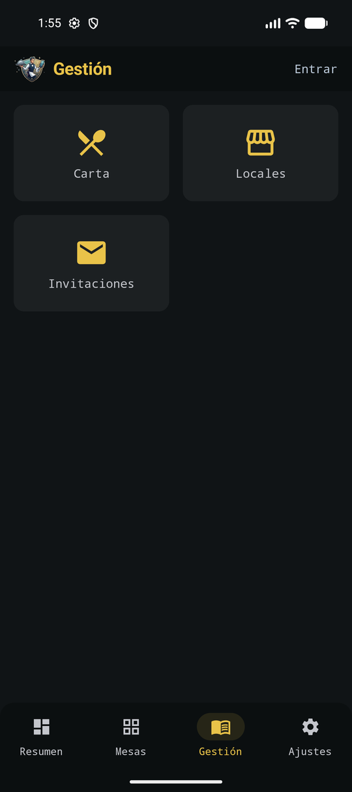

# Carta

La carta se gestiona desde la pestaña **Gestión → Carta**, no desde Ajustes. Productos, precios, categorías e iconos emoji; todo funciona **sin internet**.

*Carta, Locales e Invitaciones.*

*Productos, precios y categorías.*

## Operaciones

- Añadir producto: nombre, precio, categoría, **subfamilia** opcional (Coca-Cola → Zero / Light) e icono.
- Editar nombre, precio, categoría o subfamilia.
- Asignar **grupos de modificadores** reutilizables (punto de la carne, extras…) a cualquier SKU.
- Quitar un producto del catálogo.
- Organizar por categorías (bebidas, burgers, postres…). Dentro de cada categoría, la comanda agrupa por subfamilia.

Cada categoría lleva un icono emoji, el mismo que ves en la comanda. Los modificadores no sustituyen a un SKU: Coca-Cola Zero es un producto; «al punto» es una opción de línea.

## De dónde sale el catálogo

- **Modo Local:** editas la carta en el teléfono (seed de demostración al primer arranque, o lo que importes).
- **Sync TPV:** importas el catálogo de un TPV en la LAN. El flujo está en [Ajustes](ajustes.md) y el detalle técnico en [Sync TPV](../sync-tpv.md).
- **Turno en un establecimiento:** la carta puede quedar **bloqueada** para edición local. El local (Personal Bar + lista blanca) es entonces la fuente compartida.

El hub **Gestión** también abre [Locales](locales.md) (membresías) e [Invitaciones](invitaciones.md). No son el editor de productos.
