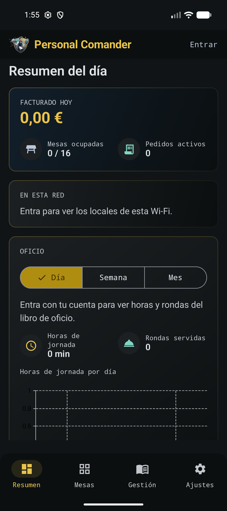
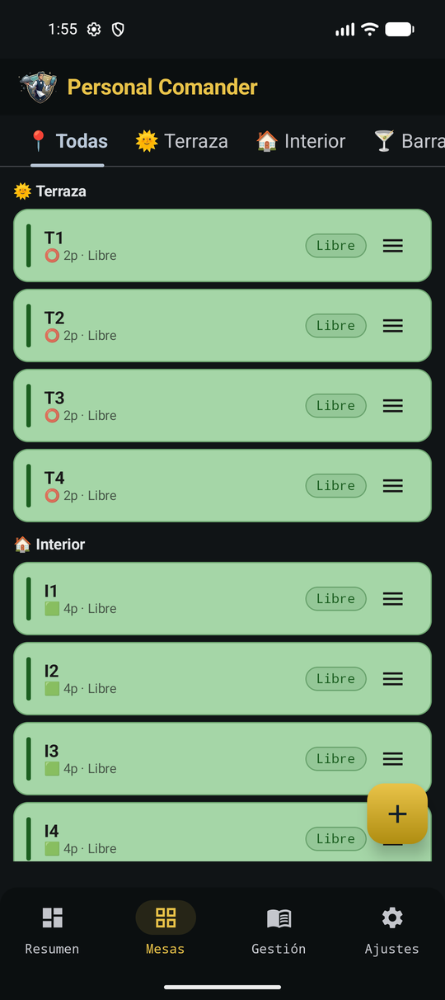
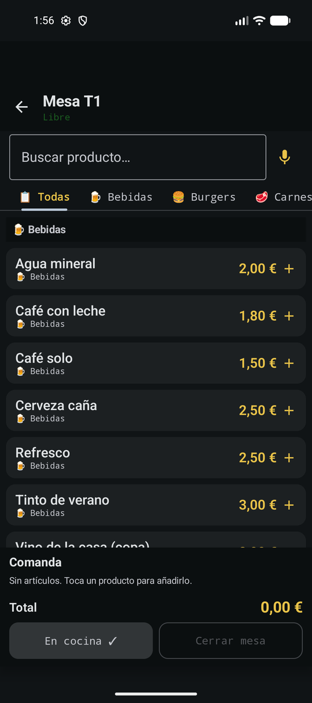
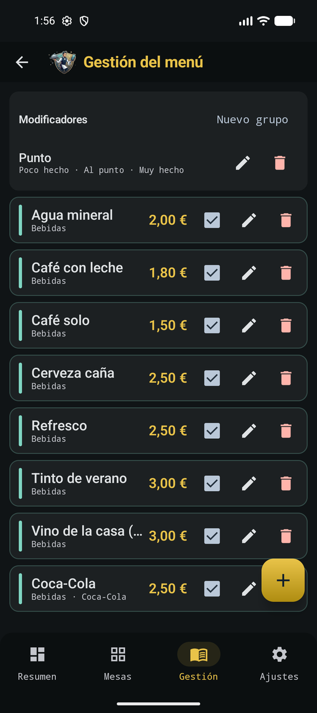
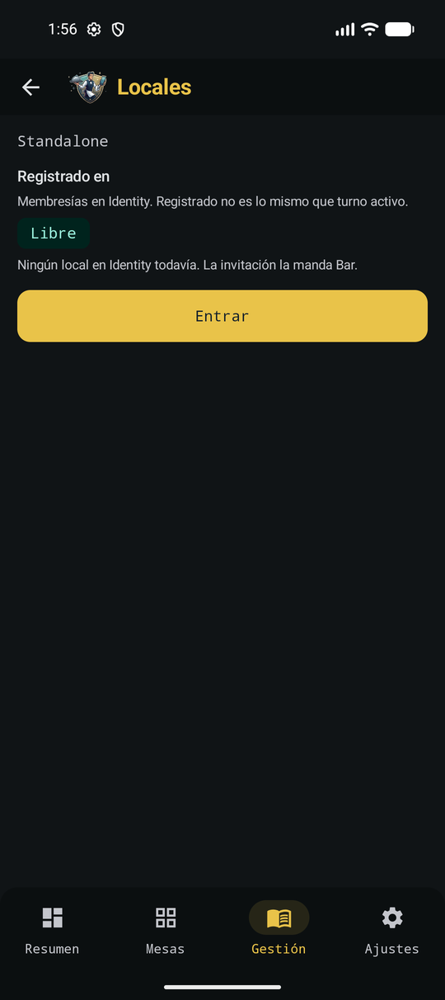
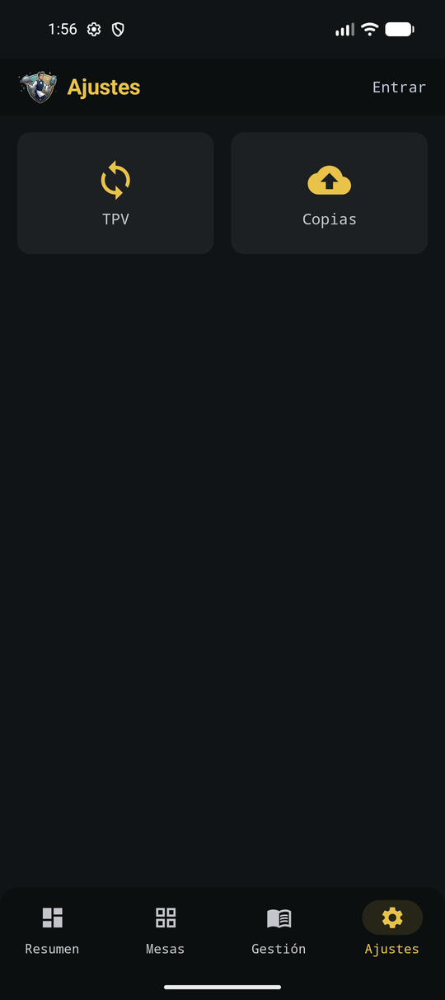
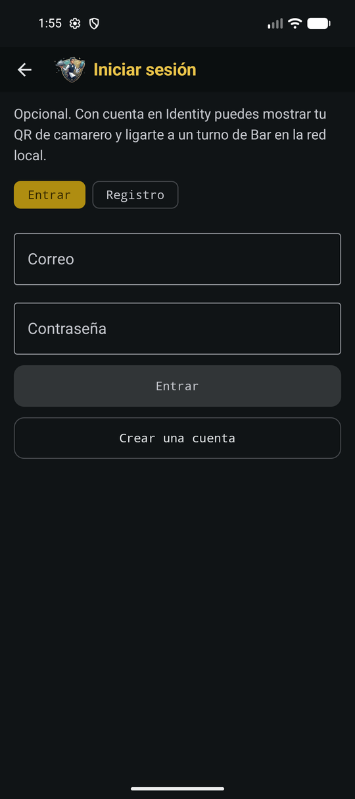

# Manual de usuario

Guía de **Personal Comander** para el camarero en sala. La release descargable actual es **v1.7**.

Commander es la app del teléfono: mesas, comanda (toque y voz) y cuenta profesional. No es el puesto del negocio (eso es Personal Bar) ni el registro de cuentas (eso es Identity, en el VPS).

[Resumen](resumen.md)

[Mesas](mesas.md)

[Comandas](comandas.md)

[Carta](carta.md)

[Locales](locales.md)

[Invitaciones](invitaciones.md)

[Ajustes](ajustes.md)

[Cuenta y turno](cuenta.md)

También: [Instalación](instalacion.md) (APK y primer arranque) y [FAQ](faq.md).

La documentación técnica (arquitectura, contratos LAN, modelo de datos) está en la pestaña **Técnica**.
