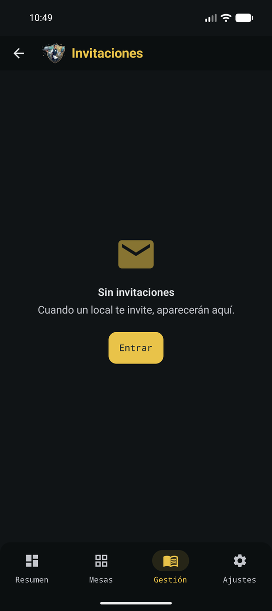

# Invitaciones

**Gestión → Invitaciones** es donde aparecerán las invitaciones de un local a tu cuenta de camarero.

*Estado vacío hasta que un local invite a la cuenta.*

Hoy la pantalla muestra un estado vacío: cuando un establecimiento te invite, saldrán aquí. Mientras tanto:

- Sin sesión: **Entrar** para iniciar sesión en Identity.
- Con sesión: **Ver mi ficha** abre el perfil (QR de la ficha pública).

Bar **asigna** cuentas que ya existen; no crea camareros. El QR, la visibilidad de ficha y el opt-in al directorio de locales se gestionan en [Cuenta y turno](cuenta.md).
